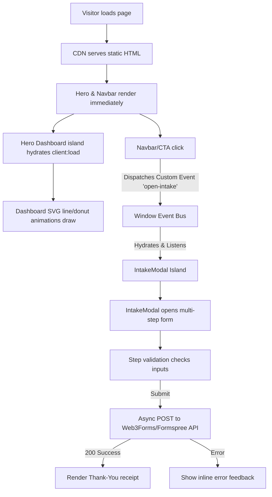

# System Architecture: Smart Marketing Digital

This document outlines the technical design, data flows, components organization, and optimization strategies utilized in the Smart Marketing Digital website.

---

## 🏗️ Architectural Core Principles

To guarantee sub-second load times and high conversions, the project implements four core principles:
1. **Static-First Compilation:** All non-interactive elements are built to raw HTML. No framework runtime is shipped for static sections, resulting in perfect Lighthouse scores.
2. **Selective Hydration (Islands):** Interactive states (the dynamic dashboard and intake form) are isolated in separate Preact containers and hydrated selectively.
3. **Vanilla CSS Optimization:** We declare CSS variables globally. Layout files load fonts in parallel. Scoped classes keep files modular, eliminating unused CSS selectors.
4. **SPA View Transitions:** The site implements Astro's native `<ClientRouter />`. When navigating pages, Astro intercepts standard document requests, performs a fetch to pull the next page, and fades the old page out while fading the new page in client-side. This yields instantaneous navigation while preserving client island state where necessary.


---

## 📊 Interaction & Data Flow

This diagram illustrates how static elements trigger the dynamic modal flow and how data reaches the serverless API.



---

## 🧩 Components Catalog

### Static Components (Astro Templates)
* **Navbar.astro:** Renders navigation headers and hamburger menus. Features a dynamic 3-span toggle that morphs into an "X" when the mobile drawer is active, and applies staggered slide-up animations to mobile drawer links. Hooks onto standard buttons using `data-trigger-intake` and fires a vanilla `CustomEvent` to keep navigation clean and detached from Preact states.
* **Hero.astro:** Sets the visual dark grid background and titles. Integrates the Preact `<Dashboard client:load />` island.
* **Solutions.astro:** Grid list of services. Styled with light background properties and flex-wrapping.
* **Framework.astro:** Visual marketing pipeline representation using connector nodes and an animated SVG feedback loop.
* **Proof.astro:** High-impact metrics segment displaying safe consulting statistics.
* **Process.astro:** Identifies the 4-step Audit, Build, Launch, and Scale workflow.
* **Founder.astro:** Layout containing Steven Morano's details, signature, and value props. Integrates Astro's native `<Image />` component, compressing your portrait asset from 224kB to 27kB WebP (an ~88% reduction) with responsive resizing.
* **Footer.astro:** Links directories, copyright, and repeats the CTA trigger buttons.


### Interactive Islands (Preact Components)
* **Dashboard.jsx:** Contains state hooks for cycling the AI insights cards and renders responsive inline SVG paths representing marketing metrics. Encapsulated in a double-bezel wrapper in `Hero.astro` for card depth.
* **IntakeModal.jsx:** Handles a 3-step stateful lead intake form, validating client name, email, website URL, budget, and services checklists before enabling submitting. Deferred to `client:idle` to optimize initial page loading.

---

## 🎨 Design Tokens & Custom CSS Properties

Central variables are declared in `/src/styles/global.css`:

```css
:root {
  /* Dark backgrounds - Ethereal Glass */
  --color-bg-dark-deep: #050505;
  --color-bg-dark-card: #0c0c0e;
  --color-border-dark: rgba(255, 255, 255, 0.08);
  
  /* Light backgrounds */
  --color-bg-light-deep: #ffffff;
  --color-bg-light-card: #f8fafc;
  
  /* Accent colors */
  --color-primary: #3b82f6;
  --color-secondary: #06b6d4;
  --color-accent-teal: #10b981;
}
```
* **Font Loading:** Heading styles reference `Outfit` to look bold and premium. Body content references `Plus Jakarta Sans` for legibility (Inter is replaced to meet visual design criteria). Fonts are preconnected to Google Servers inside `Layout.astro` to bypass rendering blocks.
* **Transitions:** Configured with custom spring physics: `cubic-bezier(0.32, 0.72, 0, 1)` for organic interactive states.
