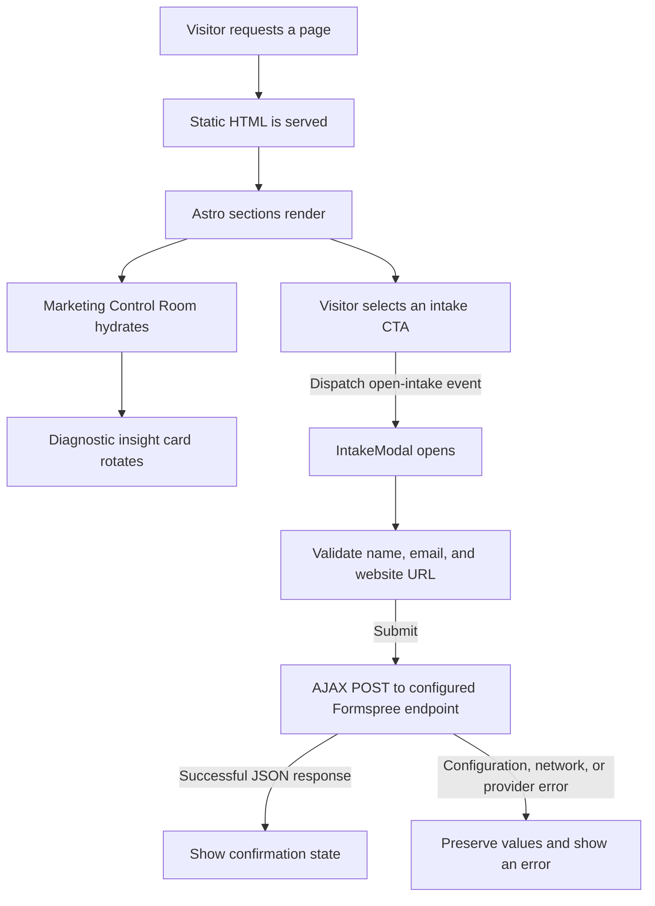

# Technical Architecture: Smart Marketing Digital

This document describes the current technical structure, component responsibilities, and data flow for the Smart Marketing Digital website.

Smart Marketing Digital is an independent Marketing Operations & Growth consulting practice. The content model emphasizes **Diagnose → Prioritize → Improve**, while the Process section adds a fourth engagement stage: **Review & Refine**.

**Production URL:** [https://smart.stevenmorano.com/](https://smart.stevenmorano.com/)

---

## Core Technical Principles

1. **Static-first output:** Astro renders public pages to static HTML during the production build, limiting client-side JavaScript to interactive features.
2. **Selective hydration:** The Marketing Control Room and intake modal are isolated Preact components. Static sections remain Astro templates.
3. **Scoped styling:** Global design tokens live in `src/styles/global.css`; component styles remain scoped to their Astro or Preact component.
4. **Shared URL configuration:** The `site` value in `astro.config.mjs` supplies the production origin for canonical URLs, Open Graph URLs, and sitemap generation. Social image tags use the same canonical origin.
5. **Client-side form delivery:** The intake modal sends inquiries directly to Formspree without a project-owned database or server endpoint.

---

## Page and Submission Flow


```mermaid
graph TD
    A[Visitor requests a page] --> B[Static HTML is served]
    B --> C[Astro sections render]
    C --> D[Marketing Control Room hydrates]
    D --> E[Diagnostic insight card rotates]

    C --> F[Visitor selects an intake CTA]
    F -->|Dispatch open-intake event| G[IntakeModal opens]
    G --> H[Validate name, email, and website URL]
    H -->|Submit| I[AJAX POST to configured Formspree endpoint]
    I -->|Successful JSON response| J[Show confirmation state]
    I -->|Configuration, network, or provider error| K[Preserve values and show an error]
```

---

## Component Responsibilities

### Astro components

- **Navbar.astro:** Renders desktop and mobile navigation and dispatches the shared intake event from CTA controls.
- **Hero.astro:** Contains the approved positioning, capability badges, CTA controls, and the Preact Marketing Control Room mount.
- **Solutions.astro:** Presents the diagnostic consulting model through six cards: Full Marketing Audit; Priorities & Action Plan; Websites, Offers & Conversion Paths; Acquisition & Channel Strategy; CRM, Follow-Up & Customer Journeys; and Analytics, Reporting & Smarter Workflows.
- **Framework.astro:** Shows strategy, acquisition, website and conversion, CRM and follow-up, measurement, and customer experience as connected marketing areas. The return loop reinforces ongoing review and improvement rather than a rigid sequence.
- **Proof.astro:** Displays five selected career metrics and clearly attributes them to Steven's broader marketing career and prior full-time roles.
- **Process.astro:** Explains the consulting engagement sequence: Diagnose → Prioritize → Improve → Review & Refine.
- **Founder.astro:** Presents Steven Morano as an independent Marketing Operations & Growth Consultant and uses Astro image optimization for his portrait.
- **Footer.astro:** Provides the closing CTA, current service taxonomy, verified social links, contact information, and privacy-policy link.
- **Layout.astro:** Supplies shared HTML structure, metadata, canonical links, Open Graph/Twitter image tags, structured data, fonts, transitions, and scroll-reveal initialization.

### Preact components

- **Dashboard.jsx:** Renders the illustrative Marketing Control Room. It presents six connected diagnostic areas, status labels, observations, recommended priorities, and a rotating insight card. It does not display live client data or performance metrics.
- **IntakeModal.jsx:** Manages the three-step inquiry form, validation, accessible consulting-area checkboxes, focus behavior, loading state, Formspree submission, success confirmation, and recoverable errors.

---

## Marketing Content Model

- **Services:** Diagnose the full picture, set priorities, and support practical improvements across the approved consulting areas.
- **Framework:** Evaluate connected marketing areas together because friction in one area can affect the others.
- **Process:** Diagnose the current situation, prioritize by goals and likely impact, implement useful improvements, then review and refine.
- **Technology and AI:** Supporting capabilities used where helpful; neither defines the practice nor performs the consulting work automatically.

---

## Formspree Submission Contract

`IntakeModal.jsx` reads the public configuration value:

```text
PUBLIC_FORMSPREE_FORM_ID
```

The browser sends a `POST` request to `https://formspree.io/f/{form-id}` with an `Accept: application/json` header. The payload includes the existing intake fields. The modal shows success only after a successful response. Missing configuration and submission failures produce visible error messages without clearing the visitor's entries.

---

## Search and Discovery

- `astro.config.mjs` defines `site: 'https://smart.stevenmorano.com'` and enables `@astrojs/sitemap`.
- `Layout.astro` derives canonical and Open Graph URLs from `Astro.site` and the current path.
- `Layout.astro` points `og:image` and `twitter:image` to `https://smart.stevenmorano.com/og-image.png`; the source asset is `public/og-image.png` at 1200×630.
- `Layout.astro` contains the ProfessionalService JSON-LD for Smart Marketing Digital and Steven Morano.
- `public/robots.txt` allows crawling and references `https://smart.stevenmorano.com/sitemap-index.xml`.
- Production builds generate `sitemap-index.xml` and a child sitemap containing the homepage and privacy page.

---

## Styling and Interaction

Design tokens are declared in `src/styles/global.css`. Individual Astro components use scoped `<style>` blocks, while the two Preact islands include styles local to their rendered interface. Shared reveal animations use `IntersectionObserver`, and interactive controls include visible keyboard focus states where applicable.
